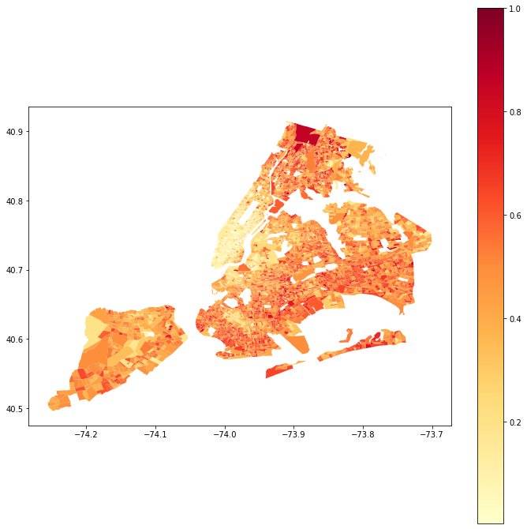

# Retirieveing Data from Census API

We will be using census question groups to retrieve information on a specific topic on block group level from the American Community Survey 5-Year Estimates.

* Retrieve information
* Format tables
* Merge data with shapefiles for mapping.

Before we being, we need to have a few things ready:

* API key from Census.gov, Register here: https://api.census.gov/data/key_signup.html
* Shapefiles, download here: https://www.census.gov/cgi-bin/geo/shapefiles/index.php
* For this exercise, use 2018 - Block Groups - New York

Using ACS questions groups are an easier way of accesing detailed data on a specific topics.
ACS Questions Groups can be found here: https://api.census.gov/data/2018/acs/acs5/groups.html

The purpose of this code is to prepare data to be exported to a GIS software. The maps plotting in the code is for verification purposes, rather than presentation.
Here is a basic calculation for calculating percentages of a commutes longer then 45 minutes

We are adding all commute times longer then 45 minutes and dividing by total. In the map above you will see a n unexpected values around LIC, because the block group in this are is very big. 
 

